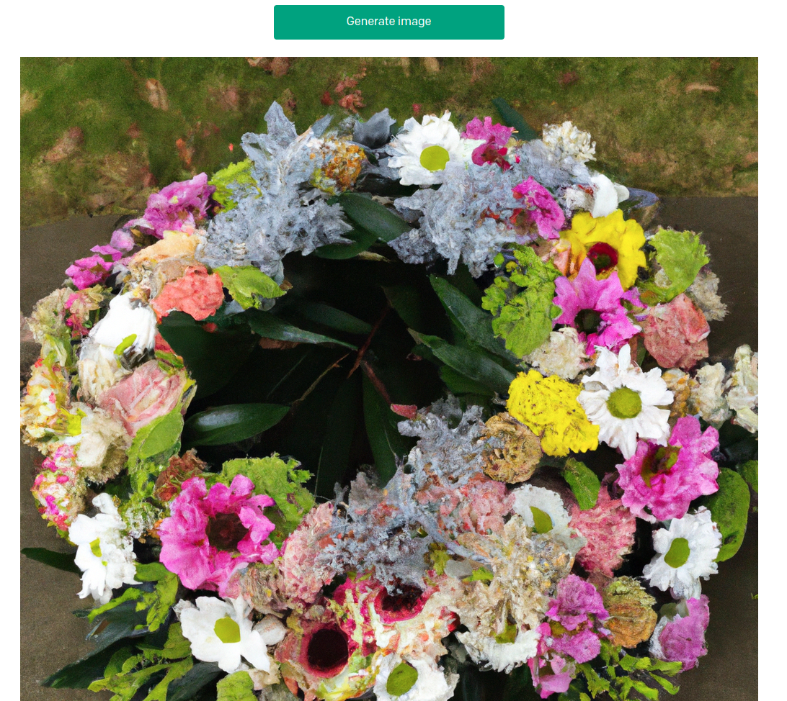

# Informe práctica NextJS, React, REST and Netlify
  
**ÍNDICE**
1. [Generador de nombres](#id1)
2. [Generador de imágenes](#id2)
3. [REST exercises](#id3)
4. [Dynamic Routes exercices](#id4)
  

***
## Generador de nombres

Primero completamos el código para la página generadora de nombres de index.js:

Con esto ya funciona todo correctamente así que [desplegamos la página en netlify](https://inspiring-cocada-308318.netlify.app/):

***
## Generador de imágenes

Para el generador de imágenes debemos modificar el código de index.js y crear en la carpeta /pages/api/ otro fichero para acceder a la generación de imágenes en lugar de buscar texto:

Para hacer la petición a la API de OpenAI y escribir con POST a espera de una respuesta necesitamos este código en /pages/api/image.js:

Luego para adaptar el índice a la salida esperada cambiamos el texto para solicitar qué imagen quiere el cliente y finalmente la imprimimos por pantalla. Este sería el código para conseguirlo:

Ahora lo [desplegamos en Netlify](https://luxury-salmiakki-11bec4.netlify.app/) y vemos el resultado final:

***
## REST exercises

1. Todos los modelos:

El resultado textual en su totalidad se puede en este [enlace](./docs/src/all_models.txt)

2. Información sobre un modelo

3. Una imagen adorable

4. Completar una frase

5. Moderación: Classifies if text violates OpenAI's Content Policy

***
## Dynamic Routes exercices

Estos ejercicios tratan básicamente de seguir un curso para comprender el ruteo dinámico:
1. Primero nos indica qué vamos a aprender:

2. Tras ello debemos descargarnos el repositorio donde trabajaremos prácticamente para completar los ejercicios propuestos:

3. Por personalizar un poco la página y entender su código nos recomienda cambiar el nombre y la pequeña indtroducción:

4. Ahora empezamos a usar dynamic routes crenado [id].js. También modificando el código de posts.js:

Esta parte resulta en la siguiente pantalla:

5. Nos hace una pregunta sobre lo que hemos aprendido:

6. Continuamos haciendo la página más compleja a través de la modificación de los ficheros, principalmente [id].js y posts.js:

Observamos la salida:

7. Ahora además queremos añadir la fecha actual a la página:

8. Cerca del final buscamos darle formato a la página introduciendo algo de CSS

9. Para que sea incluso más ordenada, añadimos un índice:

10. Para concluir los ejercicios de rutas dinámicas nos plantean una cuestión sobre lo aprendido:

